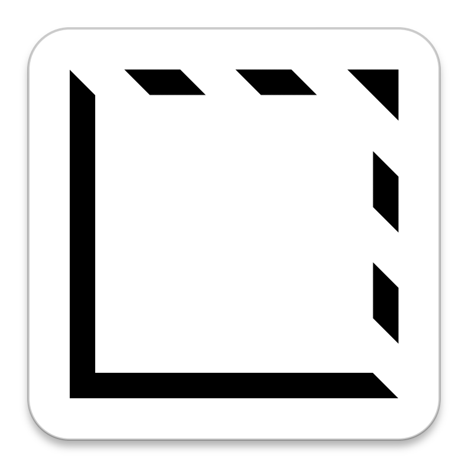

<div align="center">
  
  <h1>Lumen Blocks</h1>
  <p><strong>Accessible, styled, opinionated components for Dioxus.</strong></p>
</div>

-----
<br/>

Lumen is an ARIA-accessible, styled, opinionated component library for Dioxus inspired by the [shadcn UI](https://ui.shadcn.com) project, and built on top of the [Dioxus Primitives](https://github.com/DioxusLabs/components) unstyled components library.

> [!IMPORTANT]
> This library is still experimental. Expect bugs and breaking changes until a stable release is made.

# Getting started

For installation instructions and getting started with your project, please visit our documentation: [Installation Guide](https://lumenblocks.dev/docs/0.1/installation/)

# Running the preview

1. Ensure you have the [Dioxus toolchain](https://dioxuslabs.com/learn/0.6/getting_started/#).
2. Run this to serve the base component preview app:

```
dx serve -p docsite --platform web
```

# Development

### Without nix-shell

If you are making changes to components, you should also run this during development to keep tailwind classes up to date, on top of the `dx serve` command.

```
cd docsite && tailwindcss -i tailwind.css -o assets/tailwind.css --config tailwind.config.js --watch
```

### With nix-shell

If you have [nix-shell](https://nixos.org), these two commands can be done more ergonomically:

1. Run this command to get needed CLI tools:

```
nix-shell
```

2. Run this to serve the base component preview app:

```
just dev-docsite
```

3. Run this to keep tailwind classes up to date:

```
just dev-docsite-tailwind
```

## Acknowledgements

This project stands in the shoulders of giants, and we would like to acknowledge the following open-source projects:

- [Dioxus Primitives](https://github.com/DioxusLabs/components) for the unstyled components library.
- [shadcn UI](https://ui.shadcn.com) for the inspiration and overall structure.
- [Dioxus](https://github.com/dioxuslabs/dioxus) for the awesome framework, and several code examples that helped the development of this library.

## Funding

If you find value in this project, please consider becoming a sponsor to support ongoing development and maintenance. Your contributions help ensure Lumen Blocks continues to evolve with new features and improvements!

## License

All source-code for this project is licensed under the [MIT license](./LICENSE).

Any contribution intentionally submitted for inclusion in this repository, by you, shall be licensed as MIT, without any additional terms or conditions.

© All rights are reserved to Leaf Computer Corporation for the name "Lumen Blocks", and the "Lumen Blocks" logo.
